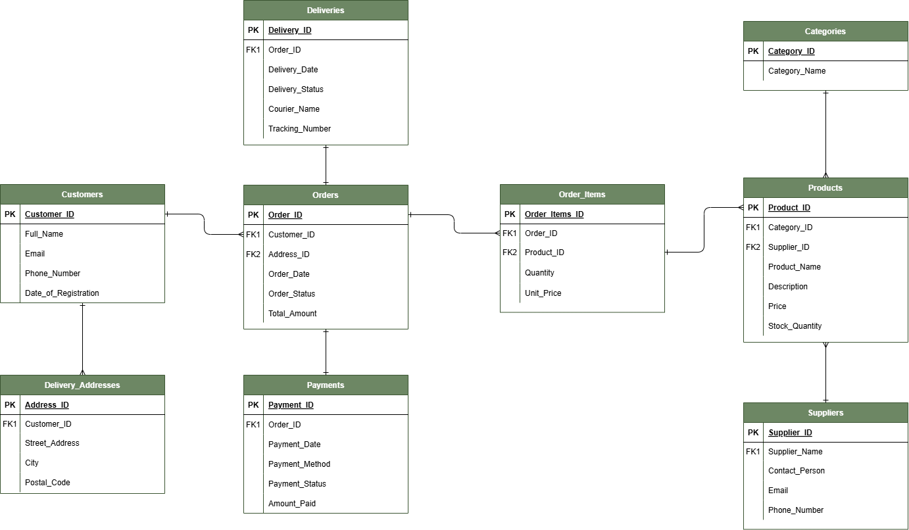

# 🛍️ WitleShop Database Project

An ERD and relational schema design mapping out an online retail system using Draw.io.


###  About the Project

WitleShop is a fictional South African online shopping database project developed to demonstrate how a relational database can be used to organise and manage information within an e-commerce business.

The database stores information about customers, products, suppliers, orders, payments, deliveries, and delivery addresses.

The project focuses on applying database design concepts such as primary keys, foreign keys, relationships, and cardinality.


## 🎯 Project Objectives

The main objectives of this project are to:

*  Design a structured relational database
*  Establish relationships between different entities
*  Use primary and foreign keys to maintain data integrity
*  Manage customer orders and order items
*  Track customer payments
*  Manage deliveries and tracking information
*  Store product, category, and supplier information
*  Develop practical database design and problem-solving skills


## 🛠️ Technologies Used

*  **Draw.io**
*  **Entity Relationship Diagram (ERD)**
*  **Relational Database Concepts**
*  **GitHub**


## 📊 Database Entities

The WitleShop database consists of the following main entities:

| Entity                    | Purpose                                              |
| ------------------------- | ---------------------------------------------------- |
|  **Customers**          | Stores customer information                          |
|  **Products**          | Stores product details, prices, and stock quantities |
|  **Categories**        | Organises products into categories                   |
|  **Suppliers**          | Stores supplier and contact information              |
|  **Orders**             | Records customer orders                              |
|  **Order Items**        | Records the products included in each order          |
|  **Payments**           | Records payments made for orders                     |
|  **Deliveries**         | Tracks the delivery of customer orders               |
|  **Delivery Addresses** | Stores customer delivery addresses                   |


## 🔗 Key Relationships

The database uses primary and foreign keys to connect related entities.

Some of the key relationships include:

* **Customers → Orders**
  One customer can place multiple orders.
* **Customers → Delivery Addresses**
  One customer can have multiple delivery addresses.
* **Categories → Products**
  One category can contain multiple products.
* **Suppliers → Products**
  One supplier can supply multiple products.
* **Orders → Order Items**
  One order can contain multiple order items.
* **Products → Order Items**
  A product can appear in multiple order items.
* **Orders → Payments**
  An order can have payment information associated with it.
* **Orders → Deliveries**
  An order can have delivery information associated with it.


## 📐 Entity Relationship Diagram

The ERD illustrates how the different entities within the WitleShop database are connected.



The diagram identifies:

*  Primary keys (PK)
*  Foreign keys (FK)
*  Cardinality
*  Relationships between entities


## 🧠 Design Decisions

1. **Customers and Delivery Addresses**

Customers and Delivery Addresses have a one-to-many relationship.
A customer may have multiple delivery addresses, and each delivery must be linked
to one of the customer's registered addresses. 
Therefore, an entity called Delivery_Addresses was created.

Delivery_Addresses contains:

- Customer_ID
- Street_Address
- City
- Postal_Code

2. **Orders and Products**

Orders and Products have a many-to-many relationship.
An order may contain multiple products, while a product may
appear in multiple orders.
An associative entity called Order_Items was created to break down
the many-to-many relationship.

Order_Items contains:

- Order_ID
- Product_ID
- Quantity
- Unit_Price

3. **Categories and Products**

Categories and Products have a one-to-many relationship. A category may
contain multiple products, while each product belongs to one category.
Category_ID is therefore stored as a foreign key in Products.

4. **Suppliers and Products**

Suppliers and Product have a one-to-many relationship. A supplier may supply
multiple products, while each product is supplied by one supplier.
Supplier_ID is therefore stored as a foreign key in Products.

5. **Orders and Payments**

Orders and Payments have a one-to-one relationship. One payment 
belongs to one order, vice versa. Order_ID is therefore stored as 
a foreign key in Payments.

6. **Orders and Deliveries**

Orders and Deliveries have a one-to-one relationship. Am order is delivered 
once. Order_ID is therefore stored as a foreign key in Deliveries.

## 📂 Project Structure

```text
 witleshope-database-project/
│
├── README.md
├── project_instructions
└── witleshop_erd_diagram.png
```

## 💡 Key Learning Outcomes

Through this project, I developed practical experience in:

* Designing relational databases
* Identifying entities and attributes
* Determining relationships and cardinality
* Using primary and foreign keys
* Structuring data to reduce duplication
* Thinking about data integrity
* Applying database concepts to a real-world business scenario
* Using GitHub to document and showcase a technical project


## 🔧 Future Improvements

Possible improvements to the project include:

* Adding more data and functionality
* Creating more advanced SQL queries
* Adding data visualisations
* Improving database optimisation
* Developing a user interface


## 👤 Author

**Kutlwano Maswanganye**

This project forms part of my ongoing development in ** data analysis and technology**.

---

⭐ **Thanks for exploring the WitleShop Database Project!**
